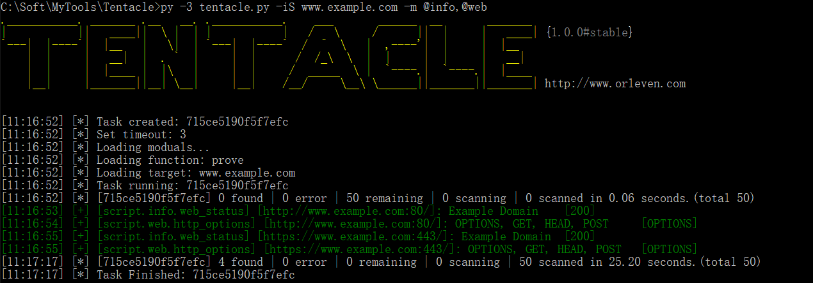

# Tentacle

```
.___________. _______ .__   __. .___________.    ___       ______  __       _______
|           ||   ____||  \ |  | |           |   /   \     /      ||  |     |   ____| {1.0.0#stable}
`---|  |----`|  |__   |   \|  | `---|  |----`  /  ^  \   |  ,----'|  |     |  |__
    |  |     |   __|  |  . `  |     |  |      /  /_\  \  |  |     |  |     |   __|
    |  |     |  |____ |  |\   |     |  |     /  _____  \ |  `----.|  `----.|  |____
    |__|     |_______||__| \__|     |__|    /__/     \__\ \______||_______||_______| http://www.orleven.com


```

Tentacle is a POC vulnerability verification and exploit framework. It supports free extension of exploits and uses POC scripts. It supports calls to zoomeye, fofa, shodan and other APIs to perform bulk vulnerability verification for multiple targets. (Still in DEV...)

[](https://www.python.org/)
[](https://www.sqlite.org/)



### Install

```
pip3 install -r requestment.txt
```

### Usage

When you run it for the first time, the configuration file `conf/tentacle.conf` will be generated automatically.

```
# Show help for tentacle.
python3 tentacle.py --help

# Show all modules, and you can see it in `script` path.
python3 tentacle.py --show

# Load target by iS/iN/iF/iT/iX/iE/gg/sd/ze/ff.
# Scan port and then it will try to send the poc.
python3 tentacle.py -m script/vul/web/web_status -iS www.examples.com         # Load target by url or host 
python3 tentacle.py -m script/vul/web/web_status -iF target.txt               # Load target by file
python3 tentacle.py -m script/vul/web/web_status -iT dcc54c3e1cc2c2e1         # Load target by recode's target
python3 tentacle.py -m script/vul/web/web_status -iX nmap_xml.xml             # Load target by nmap.xml
python3 tentacle.py -m script/vul/web/web_status -iE "powered by discuz"      # Load target by baidu/bing/360so
python3 tentacle.py -m script/vul/web/web_status -gg 'intextdiscuz'           # Load target by google api
python3 tentacle.py -m script/vul/web/web_status -sd 'apache'                 # Load target by shodan api
python3 tentacle.py -m script/vul/web/web_status -ze 'app:weblogic'           # Load target by zoomeye api
python3 tentacle.py -m script/vul/web/web_status -ff 'domain="example.com"'   # Load target by fofa api

# Load modules by -m (e.g. script/vul/web/web_status,@web)
python3 tentacle.py -iS 127.0.0.1 -m script/vul/web/web_status                # Load web_status module
python3 tentacle.py -iS 127.0.0.1 -m @web                                     # Load all module of web path
python3 tentacle.py -iS 127.0.0.1 -m script/vul/web/web_status,@web           # Load all module of web path and web_status module
python3 tentacle.py -iS 127.0.0.1 -m "*"                                      # Load all module of script path
python3 tentacle.py -iS 127.0.0.1 -m "*" -e @web                              # Load all module of script path, exclude all module of web path

# Set port scan scope
python3 tentacle.py -iS 127.0.0.1 -m script/vul/web/web_status                # Scan top 150 ports and then perform bulk vulnerability verification for multiple targets.
python3 tentacle.py -iS 127.0.0.1 -m script/vul/web/web_status -sB            # Skip port scan and then it will try the default port number server
python3 tentacle.py -iS 127.0.0.1 -m script/vul/web/web_status -lP 80-90,443  # Scan 80-90 ports and 443 port and then perform bulk vulnerability verification for multiple targets.

# Use function of modules by -m and -f  (e.g. -m web_status -f prove), and you should make sure the function of module is exist.
python3 tentacle.py -m script/vul/web/web_status -f prove

# Show task's result by -tS 
python3 tentacle.py -tS 8d4b37597aaec25e

# Export task's result by -tS to test.xlsx
python3 tentacle.py -tS 8d4b37597aaec25e  -o test

# Update by git
python3 tentacle.py --update
```


### Thanks

1. [Sqlmap](https://github.com/sqlmapproject/sqlmap)
2. [POC-T](https://github.com/Xyntax/POC-T)

